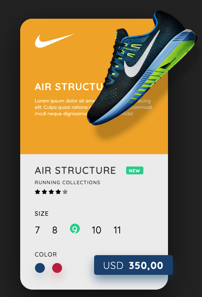
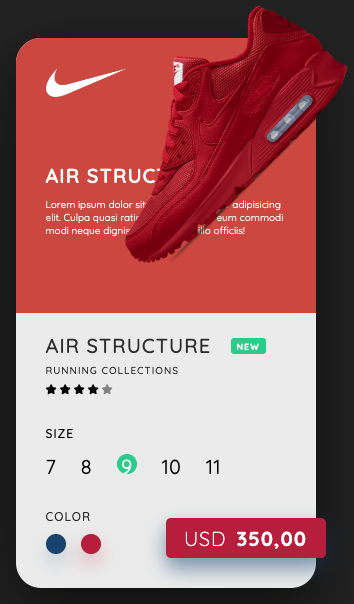

# Nike Product Card Clone Project

## 1. Project Description:

Build a clone of a Nike Product Card using HTML, CSS and JavaScript.

It demonstrates the skills required to build a custom card instead of using pre-built templates such as Bootstrap card etc.

## 2. Tech Stack:

1. HTML 

2. CSS 

3. JavaSript 

## 3. Installing:

1. Clone the repo

```
https://github.com/AAdewunmi/Project_Nike_Product_Card.git
```

2. Open Project Folder

3. Explore

4. Open index.html in Visual Studio Code, using Live Server

5. Click on a color to experience a transition between shoes.

Enjoy :)

## 4. Screenshots







## Adapted from:


UDEMY Course: 50+ Web Projects with HTML, CSS, and JavaScript.

Project Name: Project 3:  Nike Product Card 

Created by: Created by Code And Create, George Lomidze, Lasha Nozadze

Last updated 07/2022

URL: https://www.udemy.com/course/50-web-projects-with-html-css-and-javascript/


